# AutoBattler

## Overview
This repo contains the code used in a fully functioning single player autobattler. The game begins with the player in a buying phase where they are able to purchase units from a selection of random ones for the upcoming battles. Each unit has a set and tribe attribute that provides bonuses to the team depending on how many of that particular set/tribe are present on the player's team. Additionally, if three of the same unit are present they will be replaced with a more powerful version of the unit. Following this phase a randomly generated map for the current game will be shown to the player where they can view the paths available to them and choose their next destination. In combat nodes on the map the player will be faced with an enemy board layout which they can position against before starting combat. The battle will play out automatically when the player's positions are finalized. Eventually the player will arrive at the final  node on the map where they will be put up against a more powerful foe and upon defeating said enemy they will proceed to the next stage (with a new map and more powerful enemies).
<!-- full gameplay demonstration video -->

Note: Models and animations are temporary for demonstration purposes and are not included for download.  

## Gameplay Mechanics  
<!-- tiers, max units, currency -->
Units can be purchased between combat events and reorganized freely on the board. Units will automatically position themselves towards the front row and towards the middle column within that front row.  
  

### Currency  
Currency can be used to purchase units and multiple other upgrades in the shop. Additional currency can be acquired from being victorious in combat events on the map.

### Tiers  
Units are sorted into tiers with the player able to purchase units from their player tier and below. Additional player tiers can be purchased from the shop allowing more powerful units to be available from that point forward.

### Unit Capacity  
Players are restricted in the number of units they can have on the board at one time. Additional capacity can be purchased from the shop and capacity will also increase when upgrading the player's tier.

## UI  
<!-- hover to show node contents on map, right click to see unit description/stats -->
**Bonuses**  
Bonuses (tribes and sets) that currently have one or more memeber are shown on the left of the screen. The UI is updated as units are added and removed from the board when out of combat to show which bonuses are active.  
  
**Map**  
The map can be opened using the button on screen. When the map is active events can be hovered over to see details about them. Combat events will show the sets and tribes as well as the number of those types of units that the computer will have on their board if that path is chosen.  
  
**Unit**
Information about a unit can be seen by right clicking on it. The name of the unit along with it's current level is shown at the top of the display (level is shown with the number of stars). A brief description is also displayed with the stats of the unit on the right side. Additionally the unit's set and tribe is shown on the bottom and can be hovered over to display additional information about the bonus provided.  
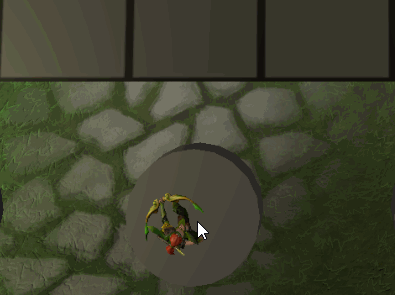  

## Map  
The map is randomly generated at the start of each playthrough and follows a series of rules to determine the layout. Each path is guarenteed to have a path to the end node. Nodes each contain an event that is also randomly determined, with the chance of that event spawning being tied to a weight value of the node type.  

  
Click to view a detailed explanation of how the map is generated
  
  

Parameters that can be set include, the minimum/maximum number of nodes per level, the maximum of nodes that can be the destination of one node (number of forward connections) and the number of levels (nodes in a path from start to end).  

  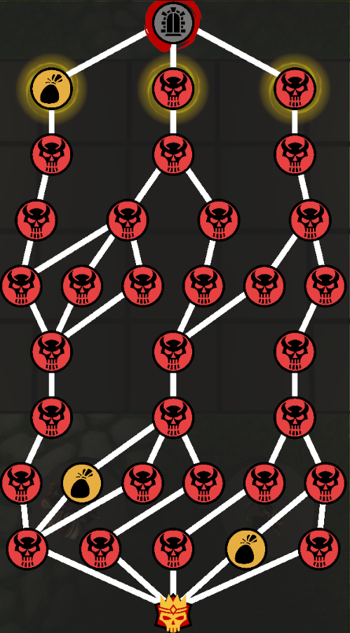 
  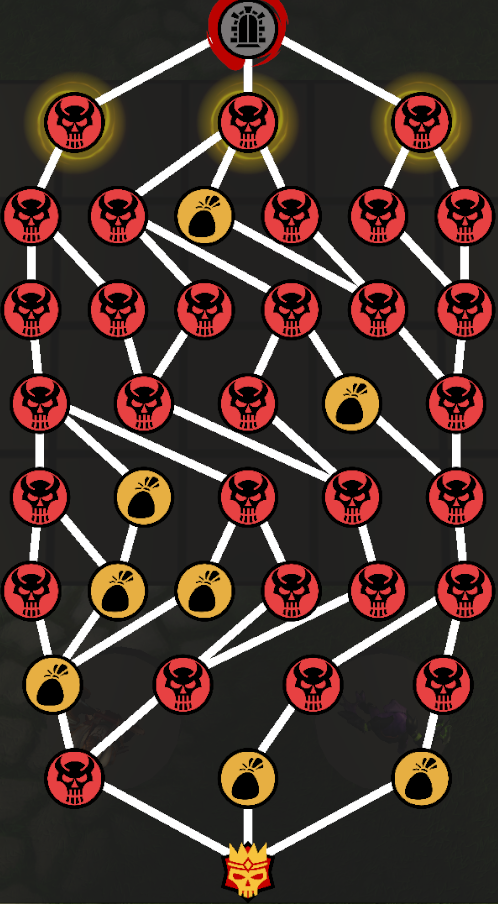 
  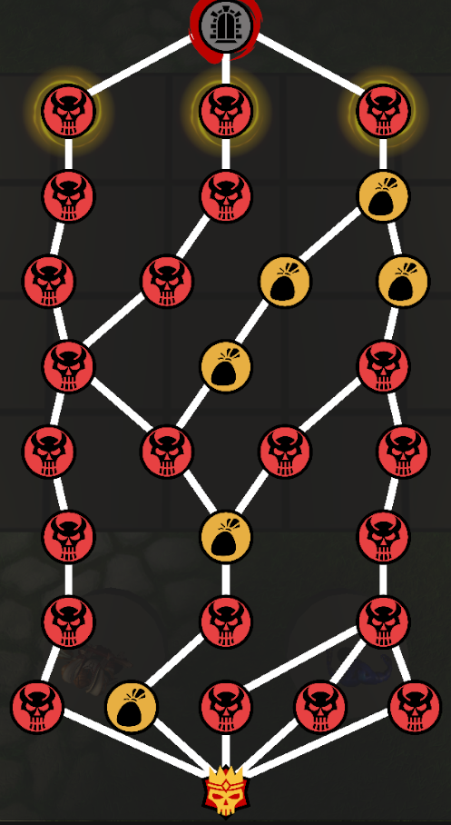

### Shop 
Shop events have a chance to spawn along paths when the map is generated. In a shop the player has access to more unit choices as well as the ability to increase their unit capacity and increase their player tier to gain access to more powerful units. Additionally, the player can refresh their shop at a cost of some currency to replace the untis that are available for purchase.  
  

## Combat  
Combat is split into several phases where multiple actions can occur. At the beginning of combat bonuses are set up depending on the number of units in each set and tribe for each team. Then a cycle begins in which units are organized by their speed stat (with randomization if multiple units have the same speed) and each unit gets their turn. For each unit in the cycle they have a turn start, attack and turn end. If a unit's turn ends and there are no units on one of the boards, combat ends, otherwise another cycle begins. Events may subscribe to any event in combat to make it easy to create new units and bonuses that interact at certain points in the battle. Additionally, units have attack and defence modifiers that interact with how they deal and recieve damage.  
  

### Bonuses (Tribes/Sets)
Note: For demonstration purposes some tribes and sets may be disabled on units when showcasing other bonuses and some unit's stats may be changed  

  
Click to view implemented sets
  
  
  + **Assassin**    
  Units with this set have a chance to critically strike for additional damage.  
  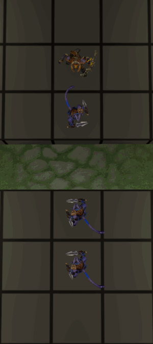  
  
  + **Balance**  
  Units with this set gain damage for each unit to the left and defence for each unit to the right.
  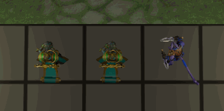  
  
  + **Berserker**  
  Units with this set gain damage based on their missing health.  
  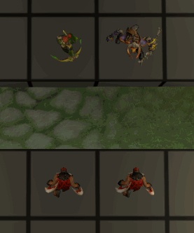  
  
  + **Chaos**  
  One chaos unit on the board has its attack replaced with a new one. This attack deals damage to the unit performing the attack based on a portion of its maximum life and then deals damage to the opponent's board in an 'x' pattern. 
  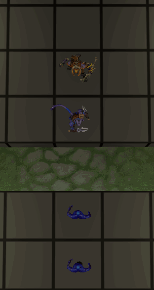 
  
  + **Knight**  
  Units with this set deflect a portion of the damage received by adjacent units, that are not part of this set, onto themselves.  
  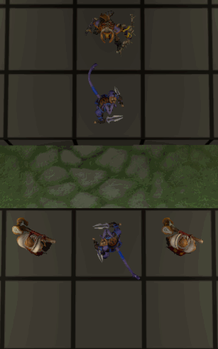  
  
  + **Mage**  
  Mages gain mana at the beginning of their turn based on a portion of the maximum health of all enemies in the same column. Upon reaching a threshold of mana, their attack is replaced (for one turn) by a powerful attack that hits the entire enemy column and their mana is reset to 0.  
  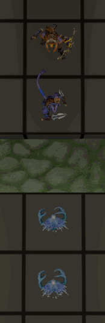  
  
  + **Ranger**  
  Rangers deal more damage based on the number of tiles between them and the unit being struck. 
  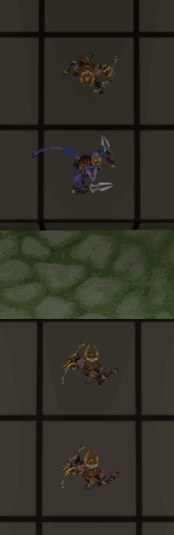  

  
Click to view implemented tribes
  
  
  + **Beast**  
  All units have a chance to cause bleeding, dealing damage to the enemy on the start of their next few turns.  
  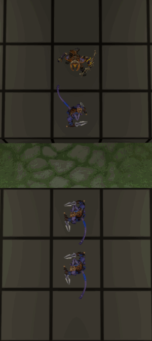  
  
  + **Elemental**  
  Elementals split on death into multiple weaker versions of the same unit.  
  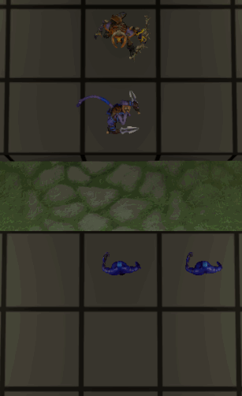  
  
  + **Human**  
  All units gain a small bonus to each stat at the beginning of combat.  
  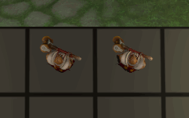  
  
  + **Orc**  
  All units gain maximum health at the beginning of combat and heal some health at the end of their turn.   
  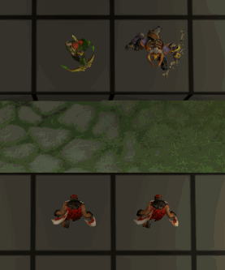  
  
  + **Otherworldly**  
  When killing enemy units, otherwordly units gain a portion of the slain enemy's stats.   
  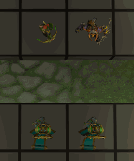  
  
  + **Undead**  
  At the start of each cycle, all enemies lose armor.  
  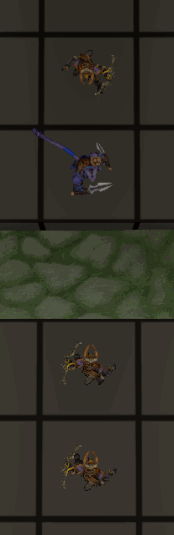  
  
  + **Void**  
  All units have a chance to stun when attacking, removing the enemies next turn.   
  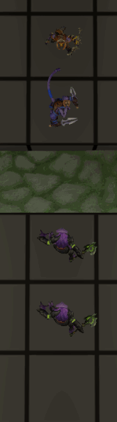  

### Units

  
Click to view implemented units
  
  <b>Section to be finished</b>

### Tripling
If three of the same units are on the board at the same time (outside of combat) they will merge into one, leveled up, stronger version of the unit. This may occur twice for the same unit allowing said unit to reach level 3.
 
